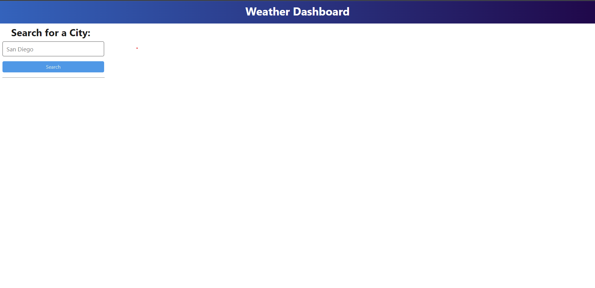
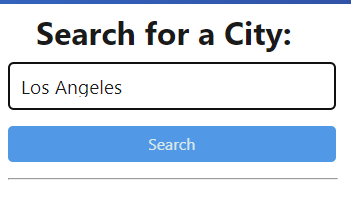
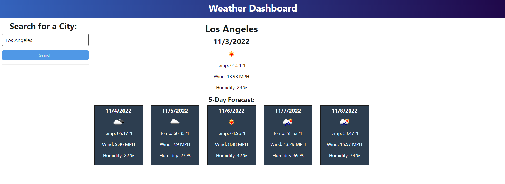

# Weather Dashboard

## Want to check your weather for the day, or your weather for the next 5 days? Look no further than this handy-dandy dashboard! You can search for any place in the world and find out how hot, windy, and humid a place is with just one input! 

# Installation 

## Open the Dashboard [here](https://joshuatoback.github.io/weather-dashboard/)!

# Usage

## When you first open the dashboard, you're met with an empty page with a search bar and infinite possibilities! 

## Search in the bar on the left like so, and then click the button to be on your way! 

## 

## Once you hit enter, you're greeted with your results! 

## 

# Future Updates

## This project is still a work in progress, but within the code there's already a few functions that need to be implemented! Here's what we have in store:

## 1. Search History Container

## 2. Customized Background based on Location

## 3. Current Time/Date Display